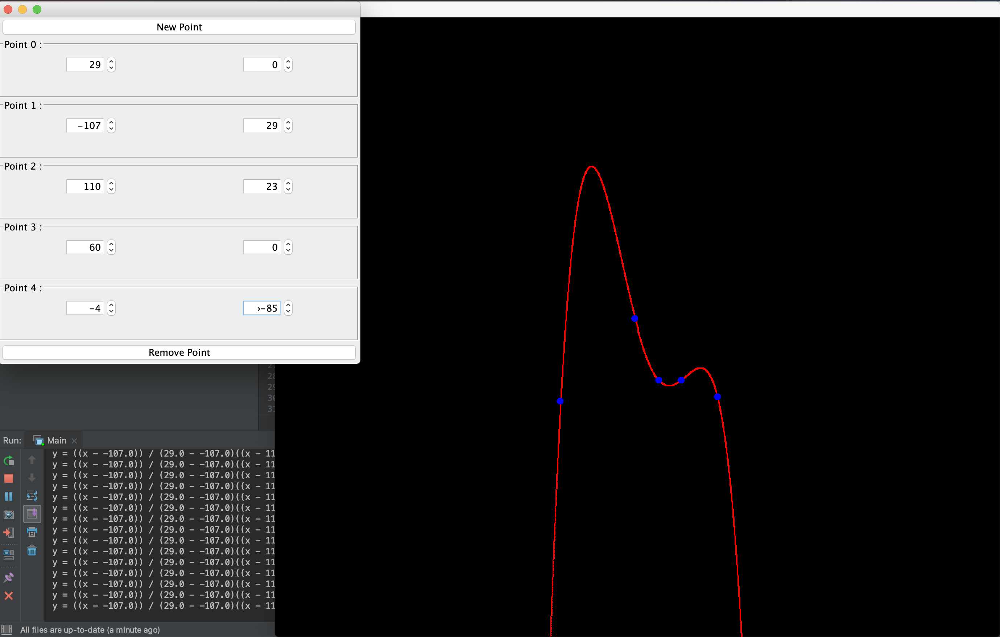
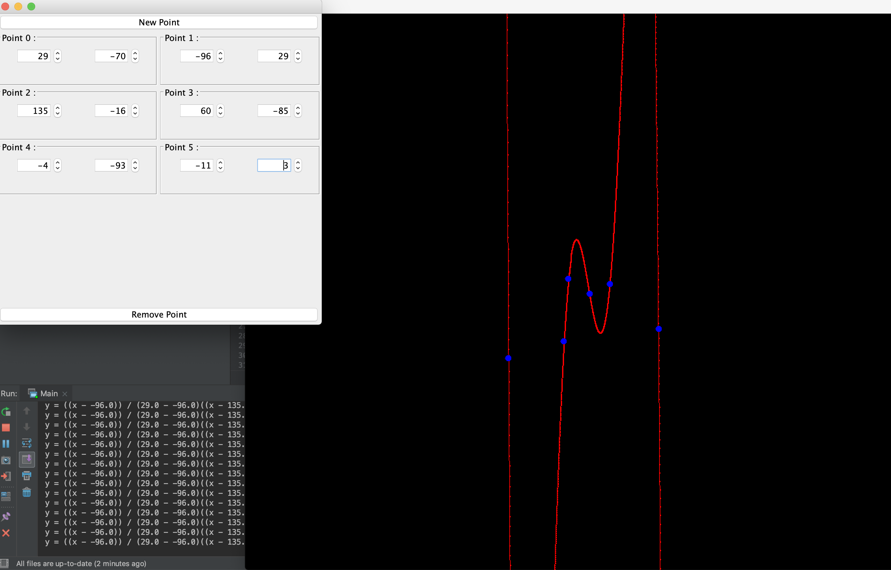

# Shahans-Lagrange-Polynomial-Interpolation
## [Runnable Download](https://github.com/shahanneda/Shahans-Lagrange-Polynomial-Interpolation/releases/download/1.0/LagrangePolynomialInterpolation.jar) 
Draws curve through points

